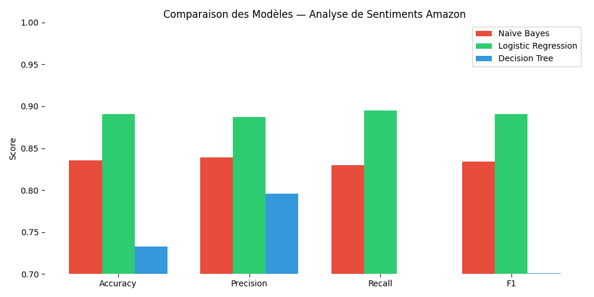
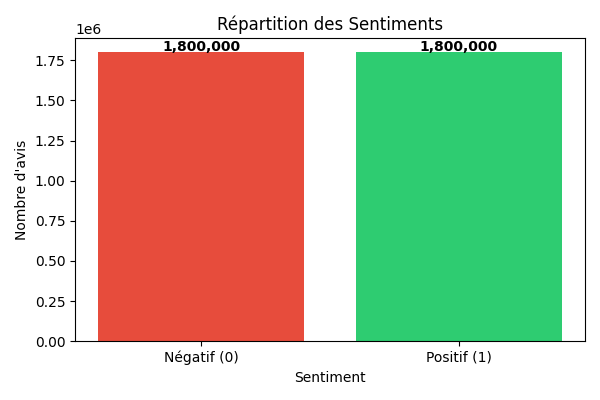
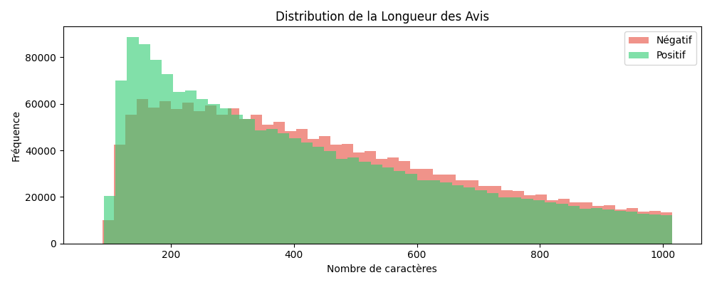
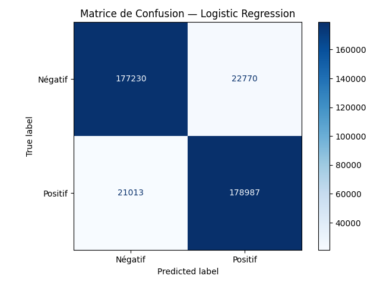
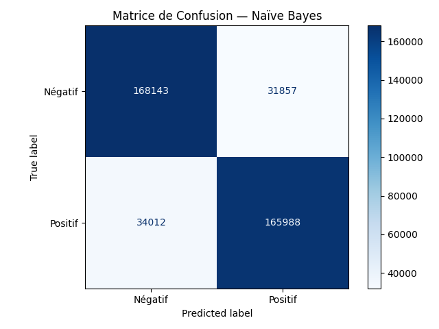
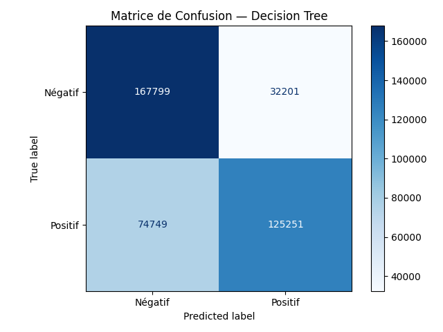

# Amazon Sentiment Analysis — Analyse de Sentiments

> **Projet Data Mining**  
> Prédiction automatique du sentiment (positif / négatif) d'avis clients Amazon à l'aide du Machine Learning.

<p>
  <a href="./Presentation_Groupe8_Analyse_Sentiments.pptx">
  
  </a>
  <a href="./Rapport_Groupe8_Analyse_Sentiments.docx">
  
  </a>
</p>

---

## Live Demo

**[https://amazon-trained-model-v1.streamlit.app](https://amazon-trained-model-v1.streamlit.app)**

L'application est déployée et accessible publiquement. Entrez n'importe quel avis client en anglais et obtenez immédiatement une prédiction de sentiment avec un score de confiance.

---

## Aperçu du projet

Ce projet réalise une **analyse de sentiments binaire** sur des avis Amazon en anglais. Le modèle classifie chaque avis comme **Positif** ou **Négatif** avec un score de confiance.

**Performances clés :**
| Métrique | Score |
|----------|-------|
| Accuracy | **89.05%** |
| Precision | **88.71%** |
| Recall | **89.49%** |
| F1-Score | **89.10%** |
| Dataset | **3.6M avis** d'entraînement |

---

## Dataset

- **Source :** Amazon Customer Reviews
- **Train set :** 3,600,000 avis (1,800,000 positifs + 1,800,000 négatifs)
- **Test set :** 400,000 avis (200,000 positifs + 200,000 négatifs)
- **Classes :** Binaire — `0` (Négatif), `1` (Positif)
- **Format :** CSV avec colonnes `label` et `text`
- **Distribution :** Parfaitement équilibrée (50% / 50%)

> Les fichiers CSV bruts (train.csv ~1.5 GB, test.csv ~175 MB) ne sont pas inclus dans ce dépôt en raison de leur taille. Le modèle pré-entraîné est fourni directement.

---

## Architecture du pipeline

```
Données brutes (train.csv / test.csv)
        │
        ▼
┌───────────────────────────┐
│  1. Prétraitement du texte │
│  • Lowercase               │
│  • Suppression ponctuation │
│  • Tokenization (NLTK)     │
│  • Suppression stop words  │
│  • Stemming (Porter)       │
└───────────────────────────┘
        │
        ▼
┌────────────────────────────────┐
│  2. Vectorisation TF-IDF       │
│  • max_features = 50,000       │
│  • ngram_range = (1, 1)        │
│  • min_df = 5                  │
│  • max_df = 0.95               │
└────────────────────────────────┘
        │
        ▼
┌──────────────────────────────────────────────┐
│  3. Entraînement de 3 modèles comparés        │
│  ┌─────────────────┐  ┌──────────────────┐   │
│  │  Naïve Bayes    │  │ Logistic Regress │   │
│  │   83.53%        │  │   89.05% ✓      │   │
│  └─────────────────┘  └──────────────────┘   │
│  ┌─────────────────┐                         │
│  │  Decision Tree  │                         │
│  │   73.35%        │                         │
│  └─────────────────┘                         │
└──────────────────────────────────────────────┘
        │
        ▼
┌────────────────────────────────┐
│  4. Sauvegarde du meilleur     │
│     modèle → best_model.pkl    │
│     vectorizer → vectorizer.pkl│
└────────────────────────────────┘
        │
        ▼
┌────────────────────────────────┐
│  5. Application Streamlit      │
│     (app.py)                   │
└────────────────────────────────┘
```

---

## Résultats des modèles

### Comparaison des 3 algorithmes

| Modèle | Accuracy | Precision | Recall | F1-Score | Temps d'entraînement |
|--------|----------|-----------|--------|----------|----------------------|
| **Logistic Regression** ✓ | **89.05%** | **88.71%** | **89.49%** | **89.10%** | ~40.5s |
| Naïve Bayes | 83.53% | 83.90% | 82.99% | 83.44% | ~12.7s |
| Decision Tree (depth=10) | 73.35% | 79.75% | — | — | — |

**→ Le meilleur modèle est la Régression Logistique** avec une accuracy de **89.05%** et un F1-Score de **89.10%** sur 400,000 avis de test.

---

## Visualisations

### Comparaison des modèles


### Répartition des sentiments dans le dataset


> Le dataset est parfaitement équilibré : 1,800,000 avis négatifs et 1,800,000 avis positifs.

### Distribution de la longueur des avis


> Les avis positifs sont légèrement plus courts que les négatifs en moyenne.

### Matrices de confusion

**Logistic Regression (meilleur modèle)**


- ✓ Vrais Positifs : 178,987
- ✓ Vrais Négatifs : 177,230
- ✕ Faux Positifs : 22,770
- ✕ Faux Négatifs : 21,013

**Naïve Bayes**


**Decision Tree**


---

## Structure du projet

```
Project/
│
├── app.py                          # Application Streamlit (interface web)
├── projet_sentiment.py             # Script complet d'entraînement et d'analyse
├── check.py                        # Script de vérification du modèle sauvegardé
├── test.py                         # Script de test/évaluation
├── test_.py                        # Script de test alternatif
│
├── requirements.txt                # Dépendances Python
│
├── best_model.pkl                  # Modèle Logistic Regression entraîné (~390 KB)
├── vectorizer.pkl                  # Vectoriseur TF-IDF sauvegardé (~1.7 MB)
│
├── X_train_tfidf.npz               # Matrice TF-IDF train (sparse, ~1 GB)
├── X_test_tfidf.npz                # Matrice TF-IDF test (sparse, ~119 MB)
│
├── train.csv                       # Données brutes d'entraînement (~1.5 GB)
├── test.csv                        # Données brutes de test (~175 MB)
├── train_clean.csv                 # Données prétraitées d'entraînement (~856 MB)
├── test_clean.csv                  # Données prétraitées de test (~95 MB)
│
├── comparaison_modeles.png         # Graphique comparaison des modèles
├── distribution_classes.png        # Répartition des sentiments
├── longueur_avis.png               # Distribution longueur des avis
├── confusion_Logistic_Regression.png  # Matrice de confusion LR
├── confusion_Naïve_Bayes.png          # Matrice de confusion NB
└── confusion_Decision_Tree.png        # Matrice de confusion DT
```

---

## Installation locale

### Prérequis
- Python 3.8 ou supérieur
- pip

### 1. Cloner le dépôt

```bash
git clone https://github.com/<votre-username>/<votre-repo>.git
cd <votre-repo>
```

### 2. Installer les dépendances

```bash
pip install -r requirements.txt
```

**Contenu de `requirements.txt` :**
```
streamlit
scikit-learn
nltk
joblib
pandas
numpy
```

### 3. Télécharger les données NLTK (automatique au premier lancement)

L'application télécharge automatiquement les ressources NLTK nécessaires :
- `punkt` — Tokenizer
- `stopwords` — Mots vides anglais
- `punkt_tab` — Données de tokenisation

### 4. Lancer l'application

```bash
streamlit run app.py
```

L'application s'ouvre automatiquement dans votre navigateur à l'adresse `http://localhost:8501`.

> **Note importante :** Les chemins absolus dans `app.py` (lignes 24-25) pointent vers un chemin local (`C:\Users\u1602\PycharmProjects\New Project\`). Pour une utilisation locale sur votre machine, modifiez ces chemins pour pointer vers vos fichiers `best_model.pkl` et `vectorizer.pkl`, ou placez ces fichiers dans le même répertoire et utilisez des chemins relatifs.

---

## Déploiement sur Streamlit Cloud

L'application est déployée sur **Streamlit Community Cloud** (gratuit).

### Méthode utilisée (sans Git)
Le projet a été déployé directement par **drag & drop** des fichiers sur l'interface Streamlit Cloud, sans nécessiter de dépôt Git configuré localement.

### Étapes de déploiement

1. **Créer un compte** sur [share.streamlit.io](https://share.streamlit.io)
2. **Créer un dépôt GitHub** et y téléverser tous les fichiers (drag & drop)
3. **Sur Streamlit Cloud :**
   - Cliquer sur `New app`
   - Sélectionner votre dépôt GitHub
   - Définir `app.py` comme fichier principal
   - Cliquer sur `Deploy`
4. **L'app est accessible en ligne** à l'URL générée automatiquement

### Fichiers requis pour le déploiement
| Fichier | Taille | Rôle |
|---------|--------|------|
| `app.py` | ~6 KB | Application principale |
| `requirements.txt` | ~47 B | Dépendances |
| `best_model.pkl` | ~390 KB | Modèle ML pré-entraîné |
| `vectorizer.pkl` | ~1.7 MB | Vectoriseur TF-IDF |

> **Astuce :** Seuls `app.py`, `requirements.txt`, `best_model.pkl` et `vectorizer.pkl` sont nécessaires pour le déploiement. Les fichiers CSV volumineux et les matrices TF-IDF ne sont **pas** requis pour l'application en production.

---

## Utilisation de l'application

### Interface principale

L'application Streamlit affiche :

1. **Métriques en haut** — Modèle, Accuracy (89.05%), taille du dataset (3.6M avis)
2. **Zone de texte** — Entrez votre avis en anglais
3. **Boutons d'exemples** — 5 avis pré-remplis pour tester rapidement
4. **Bouton d'analyse** — Lance la prédiction
5. **Résultat** :
   - ✓ POSITIF (avec ballons) ou ✕ NÉGATIF
   - Barre de confiance (0–100%)
   - Probabilités détaillées (Positif / Négatif)
   - Texte prétraité (expandable)

### Exemples de prédictions

| Avis | Prédiction attendue |
|------|---------------------|
| "This product is absolutely amazing! Best purchase I ever made." | ✓ POSITIF |
| "Terrible quality, broke after one day. Complete waste of money." | ✕ NÉGATIF |
| "I love it! Exceeded all my expectations, highly recommend." | ✓ POSITIF |
| "Very disappointing. Does not work as described." | ✕ NÉGATIF |
| "It's okay, nothing special but does the job." | ~Neutre |

---

## Fichiers du modèle

### `best_model.pkl`
- **Algorithme :** Logistic Regression (`scikit-learn`)
- **Paramètres :** `max_iter=1000`, `C=1.0`
- **Entraîné sur :** 3,600,000 avis Amazon (matrice TF-IDF)
- **Taille :** ~390 KB

### `vectorizer.pkl`
- **Type :** TF-IDF Vectorizer (`scikit-learn`)
- **Paramètres :**
  - `max_features = 50,000`
  - `ngram_range = (1, 1)` — unigrammes uniquement
  - `min_df = 5` — mot présent dans au moins 5 documents
  - `max_df = 0.95` — ignore les mots trop fréquents (>95% des docs)
- **Taille :** ~1.7 MB

### Pipeline de prétraitement (appliqué à l'inférence)
```python
def preprocess_text(text):
    text = text.lower()                              # 1. Minuscules
    text = text.translate(str.maketrans('', '', string.punctuation))  # 2. Suppression ponctuation
    tokens = word_tokenize(text)                     # 3. Tokenization
    tokens = [w for w in tokens if w not in stop_words]  # 4. Suppression stop words
    tokens = [stemmer.stem(w) for w in tokens]       # 5. Stemming (Porter)
    return " ".join(tokens)
```

---

## Technologies utilisées

| Technologie | Version | Usage |
|-------------|---------|-------|
| **Python** | 3.8+ | Langage principal |
| **Streamlit** | Latest | Interface web / déploiement |
| **scikit-learn** | Latest | Modèles ML + TF-IDF |
| **NLTK** | Latest | Prétraitement NLP |
| **joblib** | Latest | Sérialisation des modèles |
| **pandas** | Latest | Manipulation des données |
| **numpy** | Latest | Calcul numérique |
| **scipy** | Latest | Matrices sparse (TF-IDF) |
| **matplotlib** | Latest | Visualisations |
| **seaborn** | Latest | Graphiques statistiques |
| **tqdm** | Latest | Barres de progression |

---

## Rapport & Présentation

Ce projet est accompagné de documents académiques complets :

- **`Rapport_Groupe8_Analyse_Sentiments.docx`** — Rapport détaillé couvrant : problématique, état de l'art, méthodologie, résultats et conclusions
- **`Presentation_Groupe8_Analyse_Sentiments.pptx`** — Présentation PowerPoint pour la soutenance

---

<div align="center">

[Live App](https://amazon-trained-model-v1.streamlit.app) · [Contact](mailto:) · [Rapport](Rapport_Groupe8_Analyse_Sentiments.docx)

</div>
